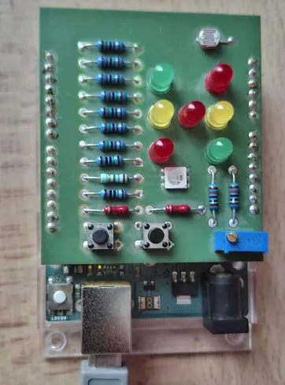

# ADC Measurement Chain — Characterizing the ATmega328P ADC

Measurement and analysis of the analog-to-digital converter (ADC) of an Arduino UNO:
noise, averaging law, effective resolution, sampling rate.

**Status:** work in progress (day 2 of 7)

## Setup



The signal source is the trimmer potentiometer on the experimenter shield, connected
as a voltage divider with its wiper on analog input A0. Nothing is added externally;
the board is powered and read out through the same USB cable. Full pin usage is listed
under *Pin Assignment*.

A measurement value travels the following path:

1. The wiper voltage is sampled by the 10-bit successive-approximation ADC of the
   ATmega328P, referenced to AVCC and clocked with the default prescaler of 128,
   which puts one conversion at roughly 112 µs.
2. The sketch reads `micros()` immediately before `analogRead()` and formats both
   into a line of constant length, `%09lu,%03d`.
3. The line leaves the ATmega328P over its UART at a nominal 115200 baud — actually
   117 647, see *Acquisition Timing*.
4. A second microcontroller on the board, an ATmega16U2, bridges that UART to USB.
   The host sees it as a virtual COM port, `COM3` on this machine.
5. `python/logger.py` reads the lines, rejects and counts malformed ones, and writes
   a CSV with a `#`-prefixed metadata header recording port, baud rate, sample count,
   bad lines, duration and the sampling interval of that particular capture.
6. All interpretation — averaging, conversion to volts, statistics — happens
   afterwards, from the CSV. The acquisition path itself performs no arithmetic.

The Arduino sends continuously and unprompted; there is no handshake and no request
protocol. Opening the port from the host merely starts reading a stream that is
already flowing, and it resets the board as a side effect, which is why every capture
begins with a fixed warm-up before the first line is kept.

## Hardware

Arduino UNO (ATmega328P) with an experimenter shield attached.

**Components on the shield:**

- 1 trimmer potentiometer (blue, 2 kΩ, adjusted with a flathead screwdriver) — signal source for all measurements
- 1 LDR (light dependent resistor) — second analog input
- 7 single LEDs: 3 red, 2 yellow, 2 green
- 1 RGB LED (red/green/blue in one package, occupies three digital pins)
- 2 momentary push buttons (no latching switches)
- Series resistors for all LEDs

## Pin Assignment

**Analog inputs**

| Component | Pin | Note |
| :--- | :--- | :--- |
| Trimmer potentiometer | A0 | primary signal source |
| LDR | A1 | responds to ambient light |

**Digital pins — LEDs**

| Component | Pin |
| :--- | :--- |
| LED red 1 | 2 |
| LED red 2 | 5 |
| LED red 3 | 8 |
| LED yellow 1 | 3 |
| LED yellow 2 | 7 |
| LED green 1 | 4 |
| LED green 2 | 6 |
| RGB LED, green channel | 9 |
| RGB LED, red channel | 10 |
| RGB LED, blue channel | 11 |

**Digital pins — buttons**

| Component | Pin | Note |
| :--- | :--- | :--- |
| Button 1 | 12 | `INPUT_PULLUP`, pressed = LOW |
| Button 2 | 13 | `INPUT_PULLUP`, pressed = LOW |

> Pins 0 and 1 are left unused — they are occupied by the serial interface.
> This leaves 12 digital pins (2–13), exactly as many as the shield requires.

## Operating Point

All measurements use the trimmer potentiometer on A0, adjusted to sit on the boundary
between ADC codes 511 and 512. In this position the converter toggles between the two
adjacent codes, which is the precondition for demonstrating the averaging law.

| Property | Value |
| :--- | :--- |
| Signal source | trimmer potentiometer, A0 |
| Operating point | code boundary 511 / 512 |
| Short-term noise | σ = 0.457 LSB (200 samples over ≈ 1 s) |
| Distinct codes | 2 — code 511 seen 141 times, code 512 seen 59 times |
| Serial link | 115200 baud nominal, raw values, timestamps from `micros()` |

The noise amplitude is smaller than one quantization step, so a single reading can
never resolve better than 1 LSB. The mean of many readings can: at 141/59 the mean is
511.295, a value the converter cannot output directly. This is dither, and how much
sub-LSB information can be recovered from it is the central question this project
sets out to answer.

### Drift of the operating point

The trimmer has not been touched since it was set on 2026-08-07. Every capture since
then records where the operating point actually sat at that moment.

| | 08-07 | 08-10 12:40 | 08-10 18:40 | 08-10 19:15 |
| :--- | ---: | ---: | ---: | ---: |
| samples | 200 | 200 | 1000 | 1000 |
| count 511 / 512 | 141 / 59 | 41 / 159 | 171 / 829 | 163 / 837 |
| fraction at 511 | 0.705 | 0.205 | 0.171 | 0.163 |
| mean [LSB] | 511.295 | 511.795 | 511.829 | 511.837 |
| sigma [LSB] | 0.457 | 0.405 | 0.3765 | 0.3694 |

The operating point has stayed on the same code boundary throughout, but the mean has
moved monotonically towards code 512: +0.500 LSB over the weekend, a further
+0.042 LSB across six hours of the same day. The direction never reverses. The
trimmer was deliberately left untouched — a mechanical adjustment on a code boundary
is riskier than a slightly different split, and the shift is itself a measurement of
long-term stability rather than a fault to be corrected.

**The falling sigma does not indicate falling noise.** For a two-level process
σ = sqrt(p·(1−p)), which is maximal at a 50/50 split and decreases towards either
side. The measured values agree with that expression to four decimal places
(0.171 → 0.37651 against 0.3765 measured; 0.163 → 0.36936 against 0.3694). Sigma here
is a measure of how often the code boundary is crossed, not of the amplitude of the
noise, and it falls simply because the signal has drifted away from the boundary.

### Stability within a single run

A continuous capture of 800 000 samples over 17 minutes separates the drift into
timescales. Divided into ten segments of 102 s each, the first nine are flat: their
means span 511.9709 to 511.9747, a range of 0.004 LSB. On a quarter-hour timescale the
setup is therefore stable to better than 0.005 LSB, and the day-long drift is not
visible at all.

The tenth segment contains a single discrete step. Narrowing it down in 1.3 s slices
locates a transition with no intermediate value: the mean falls from 511.971 to
511.785, a change of **0.187 LSB**, and remains at the new level. It occurs at
t ≈ 1001 s, some 20 s before the end of the run, and is 95 standard errors of an
8000-sample mean — far outside statistical fluctuation. Nobody was at the bench.

**A change in supply voltage cannot explain it.** The trimmer is a divider fed from the
same 5 V that supplies AVCC, so the converter measures the divider *ratio* and the
supply cancels out of the result. This is a ratiometric measurement; a sagging USB rail
moves input and reference together and leaves the code unchanged. Temperature is
excluded by the shape of the event — thermal effects ramp, they do not step.

What remains is a change in the divider ratio itself, i.e. mechanical movement at the
wiper contact. This is consistent with the monotonic drift across three days: a trimmer
adjusted once and then relaxing, with occasional discrete micro-slips. It is stated
here as a hypothesis, not a result.

| timescale | observation |
| :--- | :--- |
| 3 days | +0.67 LSB, monotonic |
| 15 minutes | stable to better than 0.005 LSB |
| single event | 0.187 LSB step in under 1.3 s |

A note on resolution. The signal occupies only two codes, so a change of operating
point appears solely as a change in the *frequency* of code 511 and can be seen only
through a windowed mean. Shorter windows buy time resolution at the cost of a noisier
estimate: at 1000 samples the standard error is 0.006 LSB against a 0.187 LSB step, at
100 samples it is 0.018 LSB. The limit is a property of a two-level process, not of the
analysis.

### Reproducibility

Two runs of 1000 samples, recorded roughly half an hour apart under identical
conditions:

| | run 1 | run 2 | difference |
| :--- | ---: | ---: | ---: |
| mean [LSB] | 511.829 | 511.837 | 0.008 |
| sigma [LSB] | 0.3765 | 0.3694 | 1.9 % |
| bad lines | 0 | 0 | — |

A deviation in sigma of under 5 % is within what a two-level process with 1000
samples produces by chance alone, and the shift in the mean is consistent with the
drift trend above rather than with instability of the setup. The measurement chain
therefore returns the same answer twice, which is the precondition for the results
that follow to mean anything.

## Design Decisions

### Timestamps are generated on the Arduino, not on the PC

The obvious alternative is to timestamp each sample in Python when the line arrives.
That would measure the wrong thing. Between the conversion and the arrival of the
line in Python sit the USB transfer, operating system buffers and the Windows
scheduler — none of which have anything to do with the ADC. The timestamp is
therefore taken with `micros()` immediately before `analogRead()`, as close to the
conversion as the platform allows.

The residual gap between the two calls is a known limitation and is quantified in
measurement 4.

### The Arduino transmits raw codes; conversion to volts happens in Python

Voltage is obtained from the raw code as

    V = raw × VREF / 1023

with VREF nominally 5.0 V. The conversion is deliberately left to the analysis stage
for three reasons:

1. **Raw data is lossless.** An integer in the range 0–1023 is exactly what the
   converter produced. A floating point voltage is already an interpretation, and
   the interpretation may turn out to be wrong.
2. **VREF is not yet known.** A USB supply typically sits between 4.6 V and 5.1 V
   rather than at exactly 5.00 V. Once the true value is determined via the internal
   1.1 V bandgap reference, correcting it means changing one constant in the analysis
   script — not repeating every measurement.
3. **The Arduino stays fast.** The ATmega328P has no floating point unit; division
   and float formatting are emulated in software and cost far more time than the
   conversion itself. Since the sampling rate is one of the quantities being
   measured, the acquisition path is kept as short as possible.

### Output lines are padded to a constant length

The straightforward way to emit a sample is to print the two values and a separator
directly. That is what the logger sketch did initially, and it produces a line whose
length depends on the magnitude of the timestamp.

Because the acquisition is transmission-bound (see *Acquisition Timing* below), the
line length *is* the sampling interval. A variable-length line therefore means a
sampling rate that changes during the run — stepping by 85 µs each time `micros()`
gains a digit. This was measured, not assumed.

From the main run onward the sketch formats each sample with

    snprintf(buf, sizeof(buf), "%09lu,%03d", t_us, raw);

zero-padding the timestamp to nine digits and the ADC code to three. Every line is
then 15 characters and the interval a constant 1275 µs.

The motivation is the autocorrelation analysis. With a variable interval the lag axis
carries no fixed time unit, so a periodic disturbance smears across neighbouring lags
instead of appearing at one well-defined period — which would defeat the purpose of
looking for mains pickup in the first place.

Two limits of this approach are worth stating. Nine digits cover 999 999 999 µs,
slightly more than the 71.6 minutes after which `micros()` wraps, so the width is
sufficient for any run this project performs. Three digits for the ADC code hold only
while the code stays within 100–999; the operating point sits at 511/512 and drift of
that magnitude is not plausible, but a line of unexpected length in the raw data
would be a signal that something more fundamental has changed.

## Acquisition Timing

The sampling rate of this measurement chain is not set by the converter. It is set by
how long it takes to send one line of text.

A single ADC conversion on the ATmega328P takes 13 ADC clock cycles at the default
prescaler of 128, i.e. roughly 112 µs. Transmitting the resulting line takes longer
than that, and because the transmission runs from a buffer while the next conversion
proceeds, the conversion time is hidden entirely. The loop period equals the line
transmission time.

This was not assumed but measured. Ten consecutive samples read over the serial port
gave timestamp differences of exactly 1020 µs, with no scatter:

```
462336,512
463356,511
464376,511
465396,512
466416,512
```

Earlier the same day, with a seven-digit timestamp instead of six, the interval was
1104–1108 µs. The difference of ~85 µs is one character.

The effect is also visible **inside a single capture**. A run of 1000 samples starting
at t ≈ 464 000 µs reports a mean interval of 1060.5 µs, a value that occurs nowhere in
the data: the individual intervals take exactly two values, 1020 µs and 1105 µs, and
nothing in between. The transition falls at t = 1 000 000 µs, where the timestamp
gains its seventh digit. Approximately 523 of the 999 intervals fall before that point
and 476 after it, which reproduces the observed mean to within a microsecond.

**The character time gives the true baud rate.** At 16 MHz in double-speed mode the
UART divisor is UBRR = 16, so the actual bit rate is

    16 000 000 / (8 × (16 + 1)) = 117 647 baud

against the 115 200 requested — an error of +2.1 %, a known consequence of the
16 MHz crystal not dividing evenly into the standard baud rates. One character is
10 bits (start, 8 data, stop), hence 10 / 117 647 = 85.0 µs. The line
`462336,512\r\n` is 12 characters:

    12 × 85.0 µs = 1020.0 µs

The measured interval matches to the microsecond. The baud rate error has therefore
been determined from the data alone, without an oscilloscope or a second instrument.

**Consequence for long runs.** Over a 15-minute acquisition `micros()` grows from one
digit to nine. Without padding, the line length grows with it and the sampling
interval steps up by 85 µs per digit:

| timestamp digits | chars/line | interval | rate |
| :--- | ---: | ---: | ---: |
| 1 | 7 | 595 µs | 1680 /s |
| 6 | 12 | 1020 µs | 980 /s |
| 9 (from t = 100 s) | 15 | 1275 µs | 784 /s |

Roughly 89 % of such a run would sit in the last row. With the timestamp padded to a
fixed nine digits the line is a constant 15 characters and the interval a constant
1275 µs, giving **784.3 samples/s**.

The variable-rate behaviour is kept here as a documented result rather than removed
from the record: it is the direct evidence that the acquisition is
transmission-bound, which is the question measurement 4 sets out to answer.

## Measurements

_(to be added)_

## Sources of Error

### Reference voltage not yet verified

All raw ADC values are converted to voltage assuming VREF = 5.00 V. In practice the
USB supply typically delivers 4.6–5.1 V, so the absolute voltage scale carries a
systematic error of up to about 8 %.

This does not affect the core results: noise, the averaging law and the effective
resolution are all expressed in LSB (least significant bits), where the reference
voltage cancels out. Only the conversion to millivolts is uncertain.

VREF will be determined without a multimeter using the internal 1.1 V bandgap
reference of the ATmega328P.

### Baud rate deviates from the nominal value by 2.1 %

The link runs at an actual 117 647 baud rather than the requested 115 200, as derived
and measured in *Acquisition Timing*. Both ends of the link are driven from the same
16 MHz crystal-derived divisor, so the two sides agree and no framing errors result.

The consequence is confined to timing: any calculation that assumes 115 200 baud
underestimates the throughput by 2.1 % and therefore overestimates the sampling
interval by the same factor. All figures in this project use the measured value.

### Timestamp resolution is 4 µs, not 1 µs

`micros()` on the ATmega328P is derived from Timer0 running with a prescaler of 64,
so its return value advances in steps of 4 µs despite being expressed in
microseconds. Every interval measured in this project is therefore quantized to 4 µs.
This is visible in the raw data: all observed intervals are exact multiples of 4.

At an interval of ~1275 µs the resulting relative uncertainty is below 0.4 % and is
negligible against the effects being measured.

### Sampling interval differs between the pre-test and the main runs

The noise pre-test samples at a fixed 5 ms spacing, the logger free-runs at 1275 µs.
Noise correlated in time — mains pickup being the obvious candidate — averages down
differently at different spacings, so sigma values from the two are not directly
comparable. Every capture therefore records its sampling interval in the CSV metadata
header.

### ADC channel crosstalk on floating inputs

The ATmega328P has a single ADC shared between all analog channels through a
multiplexer. Each conversion charges an internal sample-and-hold capacitor to the
input voltage. On a high-impedance input — an unconnected pin being the extreme
case — there is not enough charge transfer to fully settle the capacitor within the
sampling window, so the reading retains part of the previous channel's value.

This was observed directly while identifying the pin assignment. Covering the LDR
on A1 changed not only A1 but every subsequent channel, with the effect decaying
along the scan order:

| Channel | bright | dark | difference |
| :--- | ---: | ---: | ---: |
| A1 (LDR) | ~890 | ~37 | 853 |
| A2 (floating) | ~710 | ~172 | 538 |
| A3 (floating) | ~566 | ~198 | 368 |
| A4 (floating) | ~447 | ~248 | 199 |
| A5 (floating) | ~385 | ~256 | 129 |

Each channel retains roughly 60–65 % of the previous channel's excursion. A genuine
signal would appear on one channel only; the monotonic decay identifies the effect
as capacitive carryover rather than crosstalk in the wiring.

The datasheet recommends a source impedance below 10 kΩ for this reason. All
measurements in this project use the trimmer potentiometer on A0, which is read
first in every scan and has a low enough source impedance to be unaffected.

The cost of ignoring this is easy to quantify. Measured under identical conditions,
200 samples each:

| Input | σ [LSB] | range [LSB] |
| :--- | ---: | ---: |
| A0, trimmer potentiometer (low impedance) | 0.457 | 1 |
| A5, unconnected (effectively infinite impedance) | 36.504 | 134 |

A factor of roughly 80 in noise, from source impedance alone.

The floating input was evaluated as an alternative signal source and rejected. Its
excursions are far larger than thermal noise alone would account for, which points to
coupled interference from the environment — mains hum being the obvious candidate.
This was not verified spectrally and is stated as a hypothesis, not a result. It is
nevertheless sufficient grounds for rejection: interference of any periodic origin is
correlated between successive samples, and correlated contributions do not average
down as 1/√N. Using such a source would undermine the very measurement it was meant
to enable.

## Repository Contents

```
arduino/    sketches: pin scans, the noise pre-test, the logger
python/     porttest.py (serial path check), logger.py (acquisition)
data/       raw captures - excluded from the repository, except two examples
docs/       photographs and figures
```

Raw captures are not committed. A single main run is 17-18 MB, and Git stores every
version of a binary in full, so a repository holding them would grow without bound.
Two small captures are included so that the analysis can be run and the claims in this
document checked without the hardware.

**`data/example_noise_1k.csv`** — 1000 samples in the final format: timestamp padded to
nine digits, ADC code to three, constant 15-character lines. Every interval in this
file is 1276.7 µs.

**`data/example_variable_interval.csv`** — 1000 samples recorded before the sketch was
changed, kept as evidence for the claim in *Acquisition Timing*. The intervals in this
file take exactly two values and nothing in between, with the transition at
t = 1 000 000 µs where the timestamp gains its seventh digit:

```
python -c "import collections; rows=[l.split(',') for l in open('data/example_variable_interval.csv') if l.strip() and l[0] not in '#s']; t=[int(r[1]) for r in rows]; print(collections.Counter(t[i+1]-t[i] for i in range(len(t)-1)))"
```

Both files carry the full metadata header describing the conditions under which they
were recorded.